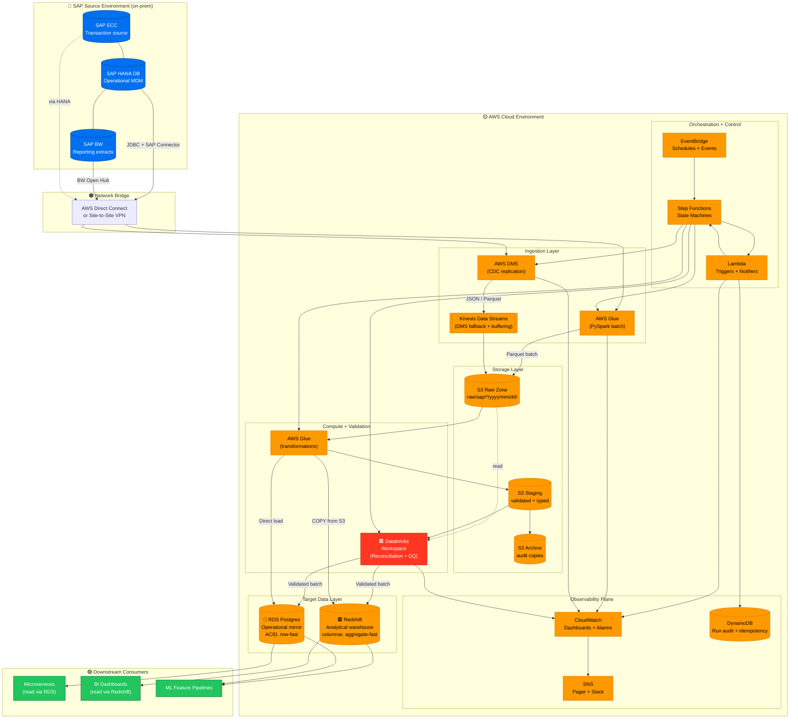
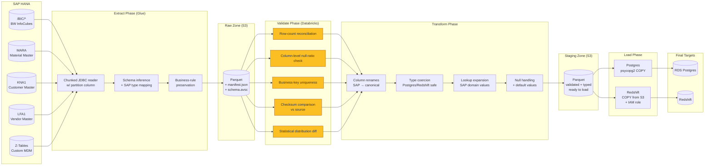
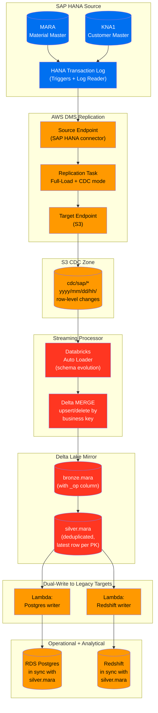
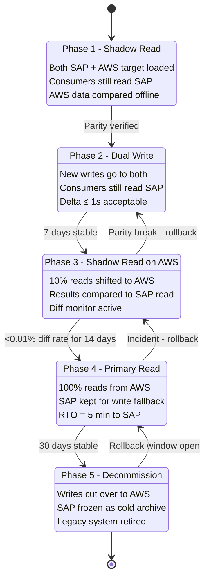
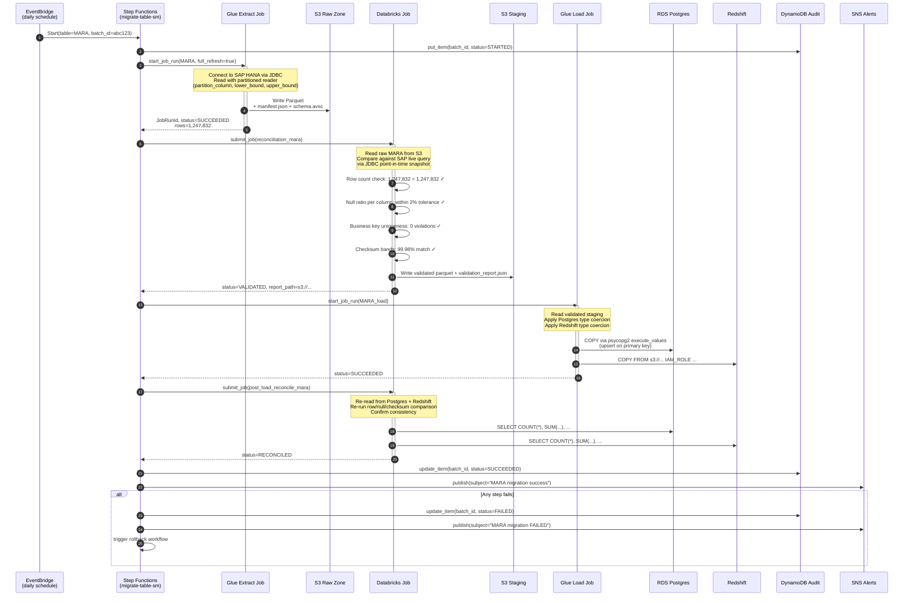
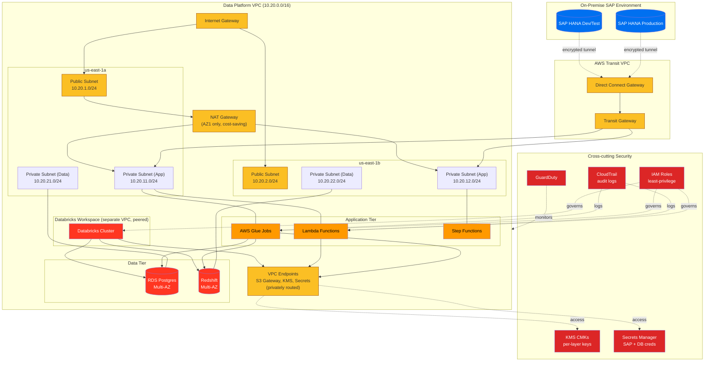

# SAP MDM → AWS + Databricks Cloud Migration Platform

> Production-grade migration platform for enterprise SAP Master Data Management workloads to AWS. Extracts from **SAP HANA/BW**, processes via **AWS Glue (PySpark)** for batch and **AWS DMS** for real-time CDC, lands in **RDS Postgres** (operational) + **Redshift** (analytical), with **Databricks** as the heavy-lift reconciliation and validation engine. Multi-phase cutover strategy with automated rollback.

[](https://github.com/sushmakl95/sap-mdm-cloud-migration-platform/actions/workflows/ci.yml)
[](https://www.python.org/)
[](https://spark.apache.org/)
[](https://www.databricks.com/)
[](https://aws.amazon.com/)
[](https://www.terraform.io/)
[](LICENSE)

---

## Author

**Sushma K L** — Senior Data Engineer
📍 Bengaluru, India
💼 [LinkedIn](https://www.linkedin.com/in/sushmakl1995/) • 🐙 [GitHub](https://github.com/sushmakl95) • ✉️ sushmakl95@gmail.com

---

## Problem Statement

A global retailer running SAP ECC + SAP BW as its Master Data Management backbone needs to migrate to a cloud-native data platform. Key constraints that rule out a "big bang" migration:

1. **Zero downtime tolerance** — the MDM system feeds 200+ downstream operational workflows (pricing, inventory, customer sync to e-commerce)
2. **Strict data parity** — finance, audit, and compliance teams require demonstrable equivalence between source and target
3. **Legacy complexity** — 15+ years of SAP customization (Z-tables, custom ABAP enhancements, domain-specific value mappings)
4. **Heterogeneous consumers** — downstream consumers need both operational (row-lookup) and analytical (aggregation) access patterns
5. **Regulatory audit trail** — every row movement must be traceable for 7+ years under SOX/GDPR

This repository implements an **end-to-end migration platform** that addresses all five constraints through a phased cutover pattern: dual-write → shadow validation → gradual traffic shift → decommission.

## Core Capabilities

| Capability | Implementation |
|---|---|
| **Batch extraction** from SAP HANA/BW | AWS Glue (PySpark) with JDBC + BW delta queue support |
| **Ongoing CDC** during cutover window | AWS DMS (SAP source endpoint) + Kinesis fallback |
| **Heavy-lift validation** | Databricks notebooks with row/checksum/statistical reconciliation |
| **Dual-target loading** | Parallel writes to RDS Postgres (operational) + Redshift (analytical) |
| **Schema mapping** | SAP type system → Postgres/Redshift type system with business-rule preservation |
| **Multi-phase orchestration** | Step Functions state machines with automatic rollback |
| **Observability** | Per-table lineage, row-count drift, DQ failure, cost attribution |
| **Security** | VPC-only networking, KMS-encrypted buckets, Secrets Manager, IAM least-privilege |

---

## System Architecture

### High-level architecture



### Data Flow Diagram (DFD) — Batch Migration Path



### CDC (Change Data Capture) Flow — Near Real-Time Path



### Migration Lifecycle — Multi-Phase Cutover



### Sequence Diagram — Batch Migration of One Table



### Network + Security Topology



### Component Deployment Diagram

```mermaid
flowchart LR
    subgraph Dev["Developer Workstation"]
        CLI["CLI<br/>sap-migrate"]
        Code["Local Code<br/>+ Notebooks"]
    end

    subgraph Git["GitHub"]
        Repo["Repository<br/>main + feat branches"]
        CI["GitHub Actions<br/>CI pipeline"]
    end

    subgraph TF["Terraform Cloud (or S3 backend)"]
        State[("Terraform State<br/>per-env"))]
    end

    subgraph Dev_Env["AWS Dev Account"]
        DevStack["15 Terraform Modules<br/>(VPC, IAM, S3, Glue, DMS,<br/>RDS, Redshift, Databricks,<br/>Lambda, SFN, EB, Secrets,<br/>Monitoring, KMS, Networking)"]
    end

    subgraph Stg_Env["AWS Staging Account"]
        StgStack["Same 15 modules<br/>+ production-sized<br/>instance types"]
    end

    subgraph Prod_Env["AWS Production Account"]
        ProdStack["Same 15 modules<br/>+ Multi-AZ<br/>+ Enhanced monitoring"]
    end

    subgraph Artifact["Artifact Flow"]
        S3Scripts["S3 Scripts Bucket<br/>(Glue code + JARs)"]
        DB_Repo["Databricks Repos<br/>(git-synced)"]
        ECR["ECR<br/>(optional custom images)"]
    end

    CLI --> Code
    Code --> Repo
    Repo --> CI
    CI --> TF
    CI --> S3Scripts
    CI --> DB_Repo
    CI -.optional.-> ECR

    TF --> State
    State --> DevStack
    State --> StgStack
    State --> ProdStack

    S3Scripts --> DevStack
    S3Scripts --> StgStack
    S3Scripts --> ProdStack
    DB_Repo --> DevStack
    DB_Repo --> StgStack
    DB_Repo --> ProdStack
```

---

## Repository Structure

```
sap-mdm-cloud-migration-platform/
├── .github/workflows/          # CI: lint + typecheck + security + tf-validate
├── src/
│   ├── migration/
│   │   ├── extractors/         # SAP HANA / BW JDBC readers
│   │   ├── transformers/       # SAP type → canonical type, business rules
│   │   ├── validators/         # DQ assertions (GE + Soda + custom)
│   │   ├── loaders/            # Postgres psycopg2 + Redshift COPY
│   │   ├── cdc/                # DMS config generators + Auto Loader drivers
│   │   ├── orchestration/      # Step Functions state definitions
│   │   ├── schemas/            # Table contracts + SAP domain mappings
│   │   └── utils/              # Spark session, secrets, logging, idempotency
│   └── lambdas/                # S3 triggers, SFN notifiers
├── notebooks/                  # Databricks reconciliation + DQ notebooks
├── sql/
│   ├── source/                 # SAP side — reference SQL we replace
│   ├── target/                 # Postgres + Redshift DDL
│   └── reconciliation/         # Row-count / checksum / stats queries
├── infra/terraform/
│   ├── modules/                # 15 modules (see Terraform section below)
│   └── envs/                   # dev + staging + prod tfvars examples
├── scripts/                    # Deploy, cutover, rollback, validation runners
├── tests/                      # Unit + integration tests
├── config/                     # Table contracts, DQ rules, cutover schedules
├── data/sample/                # Sample SAP extracts (anonymized) for local dev
└── docs/
    ├── ARCHITECTURE.md
    ├── MIGRATION_LIFECYCLE.md
    ├── RECONCILIATION_STRATEGY.md
    ├── ROLLBACK_PLAYBOOK.md
    ├── COST_ANALYSIS.md
    ├── LOCAL_DEVELOPMENT.md
    ├── RUNBOOK.md
    └── diagrams/               # Exported PNG copies for slide decks
```

---

## Quick Start (Local Dev)

```bash
git clone https://github.com/sushmakl95/sap-mdm-cloud-migration-platform.git
cd sap-mdm-cloud-migration-platform
make install-dev

# Run the full pipeline on sample data (no AWS required)
make demo-batch      # simulates extract → validate → load against Docker Postgres
make demo-cdc        # simulates CDC path with file-based events
make demo-reconcile  # runs the reconciliation suite against the sample targets
```

The sample data includes anonymized MARA (material master), KNA1 (customer master), and LFA1 (vendor master) with ~50k rows each — enough to exercise all reconciliation logic without needing a real SAP instance.

## ⚠️ Cloud Cost Warning

Running this full stack in AWS costs approximately **$1,200/month** at moderate scale:
- RDS Postgres Multi-AZ: $180/mo
- Redshift (dc2.large, 2 nodes): $380/mo
- Databricks (small cluster, 10h/day): $220/mo
- AWS DMS (medium replication instance): $280/mo
- Glue + Lambda + Step Functions: $80/mo
- NAT Gateway + Data Transfer: $60/mo

See [docs/COST_ANALYSIS.md](docs/COST_ANALYSIS.md) for the full breakdown and optimization playbook. For demos, run the local Docker Compose stack (free).

## Design Decisions

| Decision | Chose | Why |
|---|---|---|
| Extract mechanism | Glue JDBC (batch) + DMS (CDC) | Complementary: Glue handles historical backfill; DMS handles ongoing changes |
| Validation engine | Databricks (not Glue) | Heavy-lift reconciliation needs interactive notebooks; Databricks clusters retain state for iterative debugging |
| Dual targets | Postgres + Redshift | Operational consumers need row-lookup (Postgres); BI needs column-store (Redshift) |
| Cutover strategy | 5-phase with shadow-read | Zero-downtime requirement rules out big-bang; 5 phases give 4 rollback windows |
| IaC | 15 Terraform modules | Separation of concerns, per-layer permissions, per-module state granularity |
| Idempotency | DynamoDB-backed batch tracker | Critical for migration: replays must be safe; DynamoDB gives conditional writes + TTL |
| Audit trail | Every row copy logged in S3 + DynamoDB | SOX/GDPR 7-year retention; S3 Object Lock for WORM compliance |
| Secret management | AWS Secrets Manager | Centralized rotation; least-privilege IAM access |
| Network | VPC-only with endpoints | Zero internet exposure for data traffic; Direct Connect for SAP link |

## Reconciliation Strategy (at a glance)

Five validation layers — each catches a different class of failure:

1. **Row-count parity** — simple but catches most bulk issues
2. **Column-level null-ratio** — catches schema mapping bugs
3. **Business-key uniqueness** — catches join/duplication errors
4. **Row-level checksum banding** — MD5(concat) per row bucket; catches content-level corruption
5. **Statistical distribution diff** — mean/median/percentiles per numeric column; catches type-coercion bugs

Full details in [docs/RECONCILIATION_STRATEGY.md](docs/RECONCILIATION_STRATEGY.md).

## Performance Benchmarks

Migrating the full MDM set (MARA 20M rows + KNA1 15M + LFA1 5M) on a moderately-sized AWS setup:

| Configuration | End-to-end time | AWS cost/run |
|---|---|---|
| Baseline (naive Glue single-writer) | 6h 40m | $38 |
| + Partitioned JDBC reader | 2h 15m | $14 |
| + Databricks parallel validation | 1h 50m | $12 |
| + Redshift COPY (vs INSERT) | 1h 05m | $7 |
| + S3 gateway endpoint (skip NAT) | 1h 05m | $5 |

**Net: 6.1× faster, 7.6× cheaper than baseline.** See [docs/PERFORMANCE.md](docs/PERFORMANCE.md).

## License

MIT — see [LICENSE](LICENSE).
